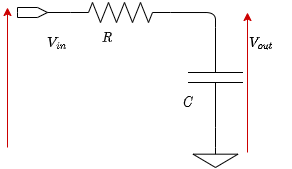
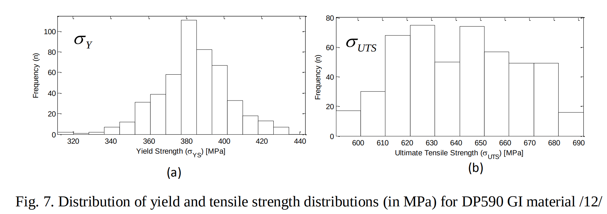
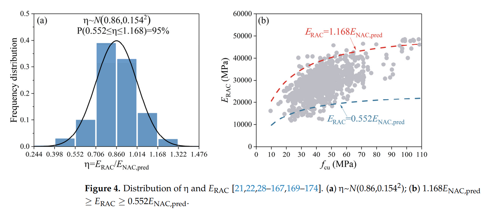
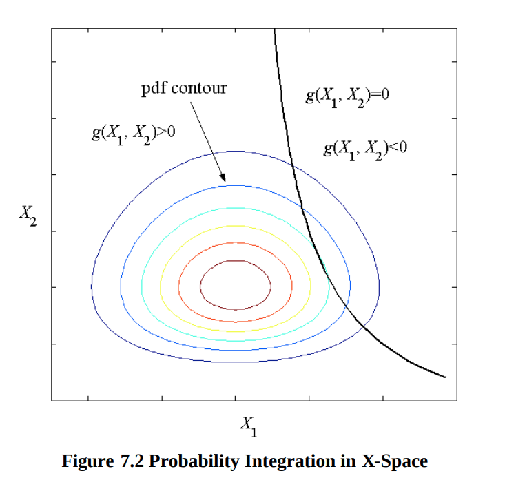
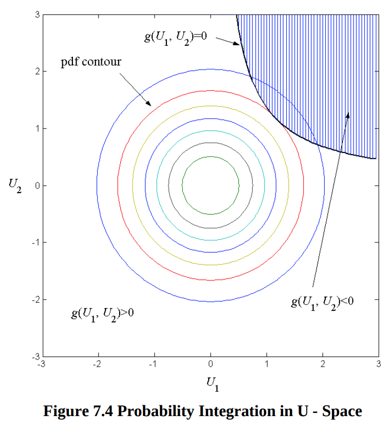
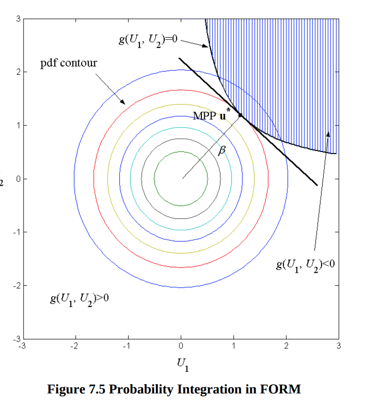

# Jan 18th 2024: Reliability of Systems
0. Consider a mechanical structure / civil structure. During the design many paramters are used for calculation or specified as a results of these calculations. For example lengths, cross sectional areas ... etc.

## Concrete Example 1

Consider an RC circuit used to filter a dual tone signal. The gain of the signal at frequency $\omega$ is given by:
$$\frac{|V_{out}|}{|V_{in}|} = \frac{1}{1 + (\omega R C)^2} $$
Assume the tones are 697Hz and 1209Hz. [DTMF signalling on Wikipedia](https://en.wikipedia.org/wiki/Dual-tone_multi-frequency_signaling). We want the higer tone to be attenuated by 1/4th. Hence we select the RC components with values R = ?, C = ?. What is teh probability that due tolerances the gain is above 1/4. Assume $\sigma_R = 0.1R$ and $\sigma_C = 0.05C$.
## Concrete Example 2 

## Quadratic Form Derivation
1. We collect these parameters in a vector $x = \begin{bmatrix}x_1, x_2, x_3 \ldots x_N\end{bmatrix}^T$.

We need pictures of the systems we are talking about!! Hopefully with labeled diagrams showing the quantities!!!

2. A system might fail if stresses or forces exceed yield strength, temperatures exceed safe limits, deflections exceed design limits, currents exceed carrying capacity ... etc. We call the quantities that determine failure **PERFORMANCE FUNCTIONS** or **LIMIT STATE FUNCTIONS**. They are functions of the design parameters. If we have $M$ of these functions we will call them $g_i(x)\; \forall \;i \in [1,M]$.

3. Manufacturing tolerances, defects and other issues cause the desired design values of the parameters to not be achieved. Instead we know them "probabilistically". 

    1. For example the length of screw might be distributed.

    2. Capacitor Distribution of values

    3. Resistor Values.

    4. Transistor transconductance parameters

    5. Concrete Youngs Modulus and cross-sectional area.

    6. Tensile strength of carbon treated steel. [Distribution of Yield Strength](https://www.researchgate.net/publication/267785655_Challenges_in_Forming_Advanced_High_Strength_Steels/link/566ecf2108ae430ab5003976/download?_tp=eyJjb250ZXh0Ijp7ImZpcnN0UGFnZSI6Il9kaXJlY3QiLCJwYWdlIjoicHVibGljYXRpb24iLCJwcmV2aW91c1BhZ2UiOiJfZGlyZWN0In19)

    

    7. Concrete $E_{RAC}$ Youngs Modulus of Recycled Aggregate Concrete [Youngs Modulus Paper](https://www.mdpi.com/2075-5309/12/2/187)
    

4. Assuming we have the distribution of each design parameter, we can ask what is the probability that one of the Performance functions exceeds its failure limit (to calculate the probability of failure). Alternatively we can ask what is the probability that it stays within bounds to evaluate reliability. $$\begin{aligned}P_f &= \mathbb{P}[g_i(x) < 0 ] \\ R &= \mathbb{P}[g_i(x) > 0] = 1 - P_f\end{aligned}$$

5. Note that since $x$ is random, $g_i(x)$ is a function of a random variable. Let the joint distribution of the parameters $x$ be $f_x(x)$. Define the failure set as: $$ \Omega_i = {x \in \mathbb{R^n} | g_i(x) < 0} $$
Then the probablility of a single failure is given by: $$P_{f, i} = \int_{\Omega_i} f_x(x) dx $$

6. The set that defines all failures is simply: $$\Omega = \bigcup_{i} \Omega_i$$ The probability of failure is then:
$$P_{f} = \int_{\Omega} f_x(x) dx $$

7. These integral are difficult to evaluate particularly when the distributions are not independent (or not nice!!). We have two issues:
    1. The distribution function is ugly!!
    2. The domain is also ugly!!

8. The solutions are:
    1. We GAUSSIANIZE the distribution function.
    2. We approximate the domain by something manageable.

We need a graph that shows why these ideas are reasonable : 
1. Distributions usually decay quickly (exponentially). Hence using approximations close to peaks is good!
2. The domains although ugly mostly don't contribute. Thus taking an easier shape is not very bad.We can make sure to over approximate such that we "exagerate" the probability of failure.

9. To GAUSSIANIZE the variables we apply the **NATAF Transformation**/**Rosenblatt Transformation**. The basic idea is: 
    - any random variable passed through its CDF becomes uniformly distributed. **Universality of the Uniform RV** a.k.a the [Probability integral transform](https://en.wikipedia.org/wiki/Probability_integral_transform). 
    
    - We then apply the inverse CDF of the normal distribution $\Phi^{-1}$ to obtain a standard normal variable. We "preserve" the mean and variance for later use.

    - In summary take the parameter $x_i$ and transform to $u_i$: $$u_i = \Phi^{-1}[F_{X_i}(x_i)]$$

10. To make the domain nicer we can use either Linear domains or Quadratic domains (any higher order polynomials are probably too much!!). We will focus on the quadratic in this text.

11. To quadratically approximate the domain consider the following taylor series expansion:
$$ \begin{aligned} 
\mathbb{P}[g(x) < 0] &= \mathbb{P}[g(u) < 0] \\ 
&= \mathbb{P}[g(u_0) + \nabla g(u_0)(u - u_0) + \frac{1}{2}(u - u_0)^T\nabla^2g(u_0)(u - u_0) + \ldots < 0] \\
& \approx \mathbb{P}[g(u_0) + \nabla g(u_0)(u - u_0) + \frac{1}{2}(u - u_0)^T\nabla^2g(u_0)(u - u_0) < 0]
\end{aligned}$$

12. We now have a glaring question "WHERE is  $u_0$"? Or in words around what point should we expand the performance function?
    - We should choose $u_0$ to be the point with the highest probability on the curve $g(u) = 0$. Since probabilities decay quickly taking the maxima should allow us to account for most of the probability mass. In mathematical notation what we are describing is: Set $u_0 = u^*$ where: $$ u^* = \max_{g(u) = 0} f_u(u) = \max_{g(u) = 0} c e^{-\|u\|^2/2} = \min_{g(u) = 0} \|u\|^2 = \min_{g(u) = 0} \|u\|$$

    - The last three inequality manipulations are obvious steps saying that for standard multivariate normal, the point with highest probability is the closest to the origin with quadratic exponential decay away from the origin

Performance function sounds like a reasonable name but, why is it called limit state function?? Maaz Mahadi thinks it is because the function roots, reperesent the boundary between failure and operational states.

13. Hence we have approximated the probability of failure by the following function: $$\begin{equation} P_f = \mathbb{P}\left[g(u^*) + \nabla g(u^*)(u - u^*) + \frac{1}{2}(u - u^*)^T\nabla^2g(u^*)(u - u^*) < 0 \right] \end{equation} $$
With: $$ \begin{equation} u^* = \min_{g(u) = 0} \|u \| \end{equation} $$

**THIS IS NOW A QUADRATIC FORM IN A GAUSSIAN RANDOM VARIABLE**

14. Two questions remain:
    1. How do we efficiently calculate $u^*, \nabla g(u^*), \nabla^2 g(u^*)$ used in Equation 1 and 2?
    2. How do we "efficiently" calculate the probability of Equation 1.

15. The answers are:
    1. Gradient descent type algorithm with some special termination criteria.
    2. Saddle point approximation.

 Maaz Will finish !! 

16. ANNOYING QUESTIONS:
    - What about correlations between the random variables? Are they accounted for in what we described above? If yes where? If not why? What does it cost for us to account for them?
    - Do we have methods to estimate how much accuracy is lost because of the approximations we made?
    - Are the approximations we made conservative or loose?
    - Any other disadvantages or advantages to be mentioned?
        - Advantages and disadvantages require comparing to alternate methods. What other alternate methods are there? And what advantages or disadvantages does this method have compared to them?
            - MONTECARLO simulation
            -  Maaz?? 
    - Is the Quadratic approx always better than the linear approximation?

<!-- # Detailed Examples Probably (We didn't read these!!)

1. [Thesis on Pipeline Failure](https://repo.pw.edu.pl/docstore/download/WUT9509f9db76394edcacb4db40dc8a4728/PTC_13th_Berlin_Paper_08_03_2018_final.pdf) -->