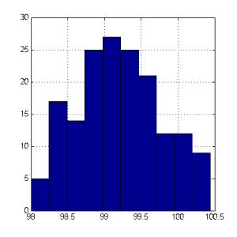
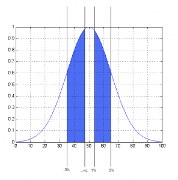
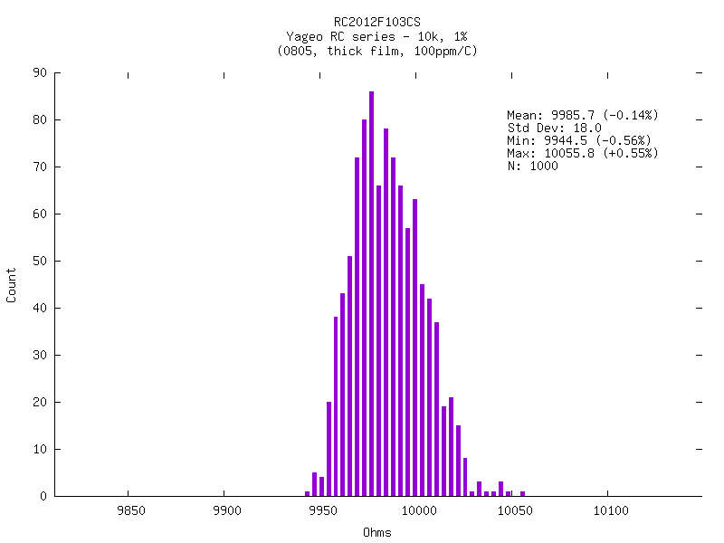

## Useful Links to Statistical Tolerances of Components

### Resistor Distributions/Tolerances
1. http://www.kerrywong.com/2013/02/01/100k-5-carbon-film-resistor-value-distribution/

2. https://www.eevblog.com/forum/projects/smd-resistor-distributions/

There is a lot more than these graphs on that website

3. 